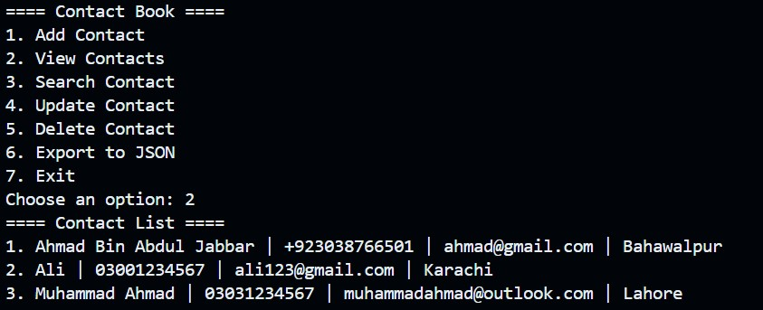

# Contact Book


#### Video Demo: https://youtu.be/Z5TR9F_ZqPM

[](https://youtu.be/Z5TR9F_ZqPM)


#### Description:

Contact Book is a menu-driven Python application that allows users to manage their personal or professional contacts efficiently. This project was developed as the final project for CS50’s Introduction to Programming with Python (CS50P).

## Features

- **Add Contact:** Add new contacts with name, phone number, email, and address. Input validation ensures only valid phone numbers (with area code) and emails are accepted.
- **View Contacts:** Display all contacts in a sorted list for easy browsing.
- **Search Contact:** Search for contacts by name or phone number, with case-insensitive matching for names.
- **Update Contact:** Update any field of an existing contact, with validation for phone and email.
- **Delete Contact:** Remove a contact from the list.
- **Export to JSON:** Export all contacts to a JSON file for backup or sharing.

## Project Structure

- `project.py`: The main application file containing all core logic and the menu-driven interface. All functions are top-level and testable, except for `main()` which handles user interaction.
- `test_project.py`: Contains automated tests for all major functions using `pytest`. Tests cover adding, searching, updating, deleting, and exporting contacts.
- `contacts.csv`: The data file where all contacts are stored in CSV format. Created automatically if it does not exist.
- `contacts.json`: The file where contacts are exported in JSON format.
- `requirements.txt`: Lists required external libraries (only `pytest` is needed for testing).

## How It Works

- The user interacts with a simple text menu.
- All data is stored in `contacts.csv` and can be exported to `contacts.json`.
- Phone numbers must be 11 digits (starting with 0) or in the format +92XXXXXXXXXX or 92XXXXXXXXXX.
- Email addresses are validated using a regular expression.
- The code is modular, with each function handling a specific task. This makes the code easy to test and maintain.

## Design Choices

- **Validation:** Regular expressions are used for robust phone and email validation, ensuring data integrity.
- **File Handling:** The CSV format is used for easy human readability and compatibility. JSON export is provided for interoperability.
- **Testing:** All core functions are parameterized and return values, making them easy to test with `pytest`.
- **User Experience:** The menu is clear and user-friendly, with helpful error messages and confirmations.

## How to Run

1. Make sure you have Python installed.
2. (Optional) Install pytest for running tests: `pip install pytest`
3. Run the application:
   ```
   python project.py
   ```
4. To run tests:
   ```
   pytest test_project.py
   ```

## Author

- Name: Ahmad Bin Abdul Jabbar
- GitHub: AhmadBinAbdulJabbar
- edX: Ahmad Bin Abdul Jabbar
- City/Country: Bahawalpur, Punjab,Pakistan
- Date: 19-05-2025

---
